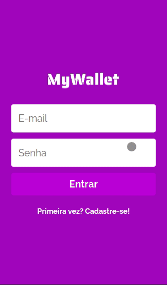

# TrackIt

Your digital mobile wallet web app written in React that help you to manage your money.

## A gif using the app



### Try by your self!

[deploy](https://my-wallet-kappa.vercel.app)

### About this project

This project is part of my portfolio, so, any feedback about the project, code, or anything that you can report that could make me a better developer will be welcome!

In this app, you can sign-up(just need a valid email, username, and make the passwords match), login, with your email and password, and start to manage your money by registering any transaction. you can also delete any transaction and make a logout (all this is demonstrated in the gif using the app).

This project was my first full-stack project(MyWallet - check the backend on the pinned projects), that is why the layout is so basic, by the way, i build this interface to test my knowledge about react, react-router, react hooks, styled-components, context API and try to improve my architecture skills.

I'll add two more features in the future: when you click on the name of some transaction, it turns into an input that allows you to update the name of the transaction.

### Tecnologies used

- React
- React-Router
- React Hooks
- Context API
- Styled Components
- Axios

### Installing this project

 - **Cloning the Repository**

```
$ git clone https://github.com/Oliv-ramon/MyWallet

$ cd MyWallet
```

 - **Installing dependencies**

```
$ npm i
```

### Connecting the App with the Server

 - Follow the instructions on the [MyWallet-Backend](https://github.com/Oliv-ramon/MyWallet-Backend) to have the server up and running on your machine.

 - With the server up and running, rename the file "example.env" to ".env". So you will have seted the value of the environment variable REACT_APP_API to localhost:5000.

 - **Running**

```
$ npm run start
```
The app will be open in http://localhost:3000.
